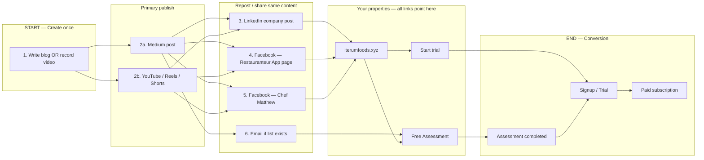

# Outlets & Repost Workflow — Where to Start and End

One place to see every outlet, the order to use them, and where the funnel starts and ends.

---

## Start → Outlets → End (overview)

```
START (create once)
    │
    ├─► Primary publish (blog or video)
    │       │
    │       ├─► Repost / share to other outlets (same or shortened content)
    │       │
    │       └─► Every outlet links TO:
    │               iterumfoods.xyz  OR  restaurant-startup-app.web.app/assessment  OR  restaurant-startup-app.web.app (trial)
    │
END (conversion on your site/app)
    • landing_viewed → assessment_started → assessment_completed → signup_completed → trial_started → subscription_started
```

---

## Flow diagram (Mermaid)



---

## Step-by-step: where to start and end

| Step | Where | What to do | Link to use (with UTM) |
|------|--------|------------|------------------------|
| **START** | Content kit (this repo) | Create **one** asset: e.g. Week 1 blog post or 1 short video from script | — |
| **1. Primary publish** | **Medium** (blog) or **YouTube/Instagram** (video) | Publish the full post or video first. This is the canonical version. | In post: assessment + iterumfoods.xyz. UTM: `utm_source=medium` or `youtube`/`instagram`, `utm_medium=organic`, `utm_campaign=week1` |
| **2. Repost — LinkedIn** | [LinkedIn company (Iterum Foods LLC)](https://www.linkedin.com/company/iterum-foods-llc/) | Post a short teaser + link to the Medium post OR direct to Free Assessment. | `https://restaurant-startup-app.web.app/assessment?utm_source=linkedin&utm_medium=social&utm_campaign=company_page` or link to Medium with UTM |
| **3. Repost — Facebook (app)** | [The Restauranteur App (Facebook)](https://www.facebook.com/profile.php?id=61587938533364) | Same teaser + link to assessment or Medium. | Assessment: add `?utm_source=facebook&utm_medium=social&utm_campaign=week1` |
| **4. Repost — Facebook (chef)** | [Chef Matthew McPherson (Facebook)](https://www.facebook.com/ChefMatthewMcpherson) | Personal share: “New post on [topic]” + link to Medium or assessment. | Same UTM as above, `utm_content=chef_profile` |
| **5. Repost — Email** | Your email list (if any) | Short summary + “Read full post” (Medium) and “Take the Free Assessment.” | `utm_source=email&utm_medium=email&utm_campaign=week1` |
| **6. Own website** | iterumfoods.xyz | Site already has assessment + trial CTAs. No “repost” here—this is the **destination** for all other outlets. | — |
| **END** | Your app + website | User hits **iterumfoods.xyz** or **restaurant-startup-app.web.app** → does assessment and/or signs up → trial → paid. | Track by `utm_source`: medium, linkedin, facebook, email, google, instagram, youtube, twitter, newsletter. |

---

## Outlets at a glance

| Outlet | Role | Start or repost? | Primary CTA link |
|--------|------|-------------------|------------------|
| **Content kit (blog/video)** | Create the asset once | **START** | — |
| **Medium** | Long-form blog; canonical post | **Primary publish** | Assessment + iterumfoods.xyz |
| **LinkedIn company** | Repost teaser + link | **Repost** | Assessment or Medium link |
| **Facebook — Restauranteur App** | Repost teaser + link | **Repost** | Assessment or Medium link |
| **Facebook — Chef Matthew** | Personal repost | **Repost** | Assessment or Medium link |
| **Email** | Nurture / newsletter | **Repost** (or dedicated email) | Assessment + trial |
| **Google Business Profile** | Local discovery (Boston/MA); post updates + link | **Repost** | Assessment or iterumfoods.xyz |
| **Instagram** | Feed + Reels; link in bio | **Primary** (video) + **Repost** | Assessment or iterumfoods.xyz |
| **YouTube** | Channel + Shorts; link in description/About | **Primary** (video) + **Repost** | Assessment or iterumfoods.xyz |
| **Twitter/X** | Short link to post or assessment | **Optional repost** | Assessment or Medium |
| **Newsletter** | Substack / Beehiiv etc. | **Repost** or primary | Assessment + trial |
| **iterumfoods.xyz** | Landing + assessment CTA | **Destination** (not repost) | Assessment, trial, Restauranteur App |
| **restaurant-startup-app.web.app** | Assessment + app/trial | **END** (conversion) | — |

---

## Repost order (recommended)

For each new piece of content (e.g. one blog post), use this order. Steps 7–9 are optional; step 10 is the rule for every outlet.

1. **Publish on Medium** (blog) or **YouTube / Instagram** (video) with correct UTM links.
2. **Same day or next:** **Google Business Profile** — post an update with link to assessment or site (strong for local).
3. **Same day or next:** **LinkedIn company page** — 1–2 sentences + link to Medium or direct to assessment.
4. **Same day or next:** **Facebook (Restauranteur App page)** — same or similar copy + link.
5. **Same day or next:** **Instagram** — feed post + Reels (same video); link in bio = assessment or iterumfoods.xyz.
6. **Same day or next:** **YouTube** — upload same video; link in description and About to assessment/site.
7. **Optional:** **Facebook (Chef Matthew)** — personal share with same link.
8. **Optional:** **Twitter/X** — one tweet with link to Medium or assessment.
9. **Optional:** **Email / Newsletter** — summary + "Read more" (Medium) and "Take the Free Assessment" (assessment link).
4. **Optional:** Share from **Chef Matthew** profile to personal network with same link.
5. **Optional:** Send **email** with summary + “Read more” (Medium) and “Take the Free Assessment” (assessment link).
6. **Always:** Ensure every link from every outlet points to **iterumfoods.xyz**, the **assessment**, or **Start trial** — so the **END** of the workflow is always on your site/app.

---

## Where it ends (conversion)

The workflow **ends** when a user:

1. Lands on **iterumfoods.xyz** or the **assessment** or **trial** page (from any outlet).
2. Completes the **Free Restaurant Assessment** (optional but valuable).
3. **Signs up** and starts **trial**.
4. Converts to **paid subscription**.

Track by `utm_source` in your analytics to see which outlet (medium, linkedin, facebook, email, etc.) drove them. Funnel stages are in [MARKETING_FUNNEL_MAP.md](../MARKETING_FUNNEL_MAP.md).

---

## Recommended additions (primary places to post)

These outlets are worth adding as **primary or repost** channels for your audience (restaurant owners, buyers, founders in MA and beyond).

| Outlet | Why add it | Role | UTM `utm_source=` |
|--------|------------|------|-------------------|
| **Google Business Profile** | Local discovery: “restaurant consultant Boston,” “restaurant permits MA.” You can post updates and add a link to your site/assessment. Drives high-intent traffic. | Repost (or post offers/updates with link) | `google` |
| **Instagram** ([@iterumtochangetheworld](https://www.instagram.com/iterumtochangetheworld)) | Restaurant and chef audience; link in bio to assessment or iterumfoods.xyz; Reels = same short video you use on YouTube/Facebook. | Primary (Reels) + Repost (feed) + link in bio | `instagram` |
| **YouTube (channel)** | Treat as its own outlet: channel description link + same Shorts/videos. Search and suggested feed can drive long-term traffic. | Primary (video) + link in description/about | `youtube` |
| **Twitter/X** | Low effort: one tweet with link to Medium or assessment. Some operators and founders still active. | Optional repost | `twitter` |
| **Newsletter (Substack, Beehiiv, etc.)** | If you publish a newsletter, it’s your “email” outlet in published form. Builds list and sends traffic to assessment/trial. | Repost or primary (dedicated newsletter post) | `newsletter` or `email` |

**Suggested repost order with additions:**  
Medium/YouTube → **Google Business Profile** (post update) → LinkedIn → Facebook (both) → **Instagram** (feed + Reels) → **Twitter** (optional) → Email/Newsletter.

Add each new outlet’s URL to the [content-kit README](README.md) “Social / brand links” or “URLs to use” so you have one place for links and UTM.
